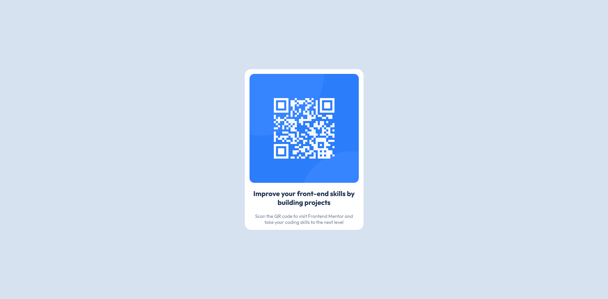

# Frontend Mentor - QR code component solution

This is a solution to the [QR code component challenge on Frontend Mentor](https://www.frontendmentor.io/challenges/qr-code-component-iux_sIO_H). Frontend Mentor challenges help you improve your coding skills by building realistic projects. 

## Table of contents

- [Overview](#overview)
  - [Screenshot](#screenshot)
  - [Links](#links)
- [My process](#my-process)
  - [Built with](#built-with)
  - [Continued development](#continued-development)
  - [Useful resources](#useful-resources)
- [Author](#author)

## Overview

### Screenshot

### Links

- Live Site URL: [Link1](https://your-live-site-url.com)

## My process

### Built with

- Semantic HTML5 markup
- CSS custom properties
- Flexbox
- Mobile-first workflow

### Continued development

Use a framework for fast development, either `Bootstrap` or `tailwind`

### Useful resources

- [Perfect Pixel](https://chrome.google.com/webstore/detail/perfectpixel-by-welldonec/dkaagdgjmgdmbnecmcefdhjekcoceebi?hl=en) - This tool helped me to get perfect pixel for `img`, `h1` and `p` elements.

## Author

👤 **Wassim Chakib**

- GitHub: [@wassimchakib](https://github.com/wassimchakib)
- Twitter: [@wassim_chakib](https://twitter.com/wassim_chakib)
- LinkedIn: [LinkedIn](https://www.linkedin.com/in/wassimchakib/)
